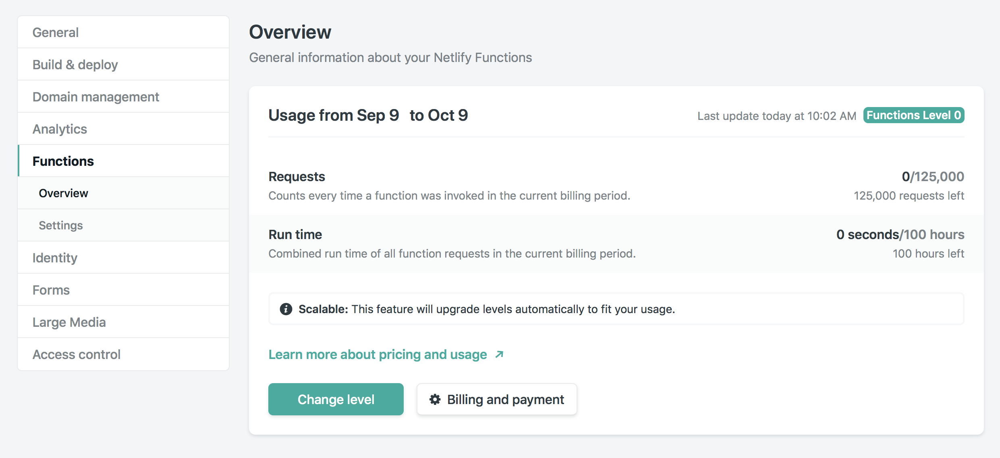
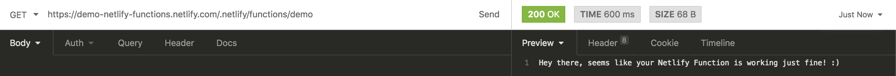

# Demo: Netlify Functions

This is a super-simple demo of Netlify Functions. It is based from an excellent previous example at [https://luetkemj.github.io/180505/netlify-lambdas-as-simple-as-possible](https://luetkemj.github.io/180505/netlify-lambdas-as-simple-as-possible).

Netlify Functions is a really sweet way of doing serverless functions, without the hassle of learning any of the big cloud platforms. Currently, you get 125 000 function requests and 100 hours of run time for absolutely \$0. No reason to go with old virtual machines any more. Just don't.

**Additional resources can be found at:**

- [Netlify Functions documentation](https://www.netlify.com/docs/functions/)
- [Netlify Functions examples](https://functions.netlify.com/examples/)
- [Netlify Functions tutorials](https://functions.netlify.com/tutorials/)

## Instructions

For Netlify Functions to work, you will need to have [Continuous Deployment](https://www.netlify.com/docs/continuous-deployment/) to be activated. In other words, you will need to have a repository (for example on Github) with this code, and then connect it with Netlify.

## How it looks inside of Netlify

## Running the function

### Plainly GETting it

Use a REST client like Insomnia or just even your regular browser and go to: [https://{YOUR_SITE}.netlify.com/.netlify/functions/demo](https://{YOUR_SITE}.netlify.com/.netlify/functions/demo)

### From the demo HTML

There is also an `index.html` that's deployed to your root. On that page, you will find a button that should run the function via the modern Fetch API. That gives you a very vanilla hint at how to use functions in a more realistic scenario. **NOTE**: For this to work, the site needs to be deployed.

### Running the function locally

Read the [Netlify Functions documentation](https://www.netlify.com/docs/functions/) for more details on that.
